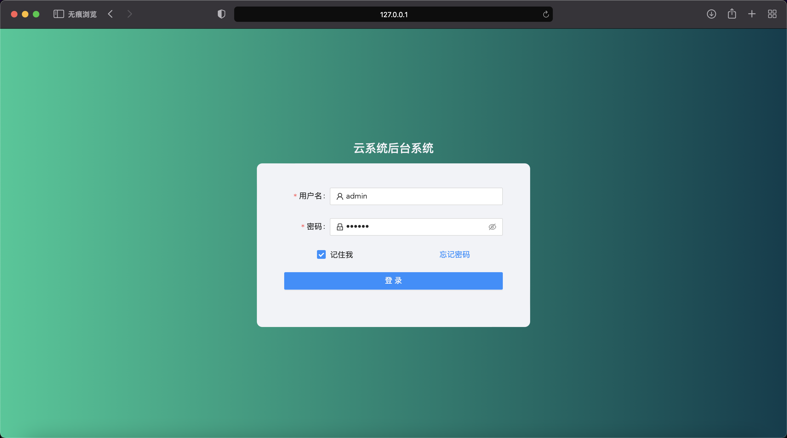
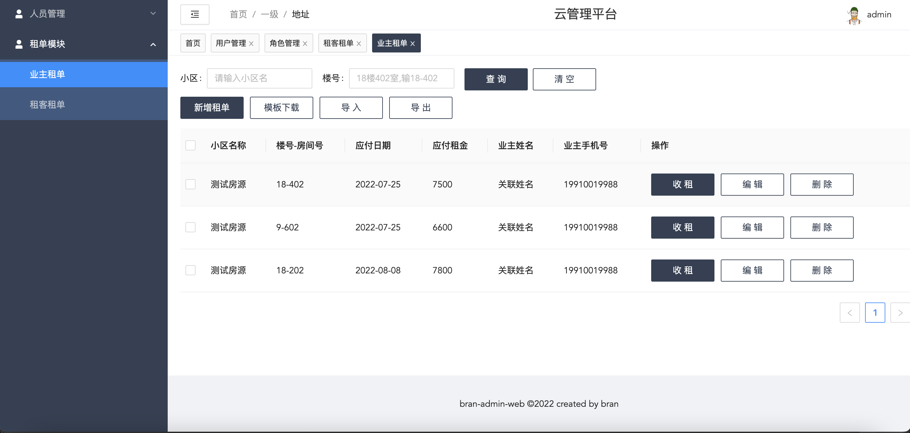

# bran-admin-web

## demo 图例

## 相关技术

[pinia-plugin-persist](https://seb-l.github.io/pinia-plugin-persist/) pinia 持久化插件

## 浏览器支持

|  IE / Edge |  Firefox |  Chrome |  Safari |  iOS Safari |
| --------- | --------- | --------- | --------- | --------- |
| Edge| last 2 versions| last 3 versions| last version| last 2 versions

